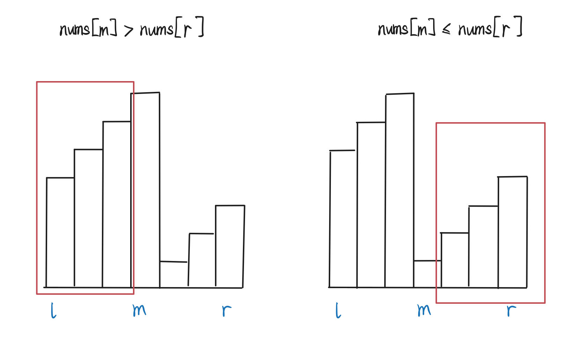

# 33. Search in Rotated Sorted Array

There is an integer array `nums` sorted in ascending order (with **distinct** values).

Prior to being passed to your function, `nums` is **possibly rotated** at an unknown pivot index `k` (`1 <= k < nums.length`) such that the resulting array is `[nums[k], nums[k+1], ..., nums[n-1], nums[0], nums[1], ..., nums[k-1]]` (**0-indexed**). For example, `[0,1,2,4,5,6,7]` might be rotated at pivot index `3` and become `[4,5,6,7,0,1,2]`.


Given the array `nums` **after** the possible rotation and an integer `target`, return *the index of* `target` if it is in `nums`, or `-1` if it is not in `nums`.

You must write an algorithm with `O(log n)` runtime complexity.


### Idea

Binary search.



### C++ Solution


```cpp
class Solution {
public:
    int search(vector<int>& nums, int target) {
        int l = 0;
        int r = nums.size() - 1;
        while (l <= r) {
            int m = (l + r) / 2;
            if (nums[m] == target) {
                return m;
            }
            if (nums[m] > nums[r]) {
                // Check left.
                if (nums[l] <= target && target <= nums[m]) {
                    r = m - 1;
                } else {
                    l = m + 1;
                }
            } else {
                // Check right.
                if (nums[m] <= target && target <= nums[r]) {
                    l = m + 1;
                } else {
                    r = m - 1;
                }
            }
        }
        return -1;
    }
};
```