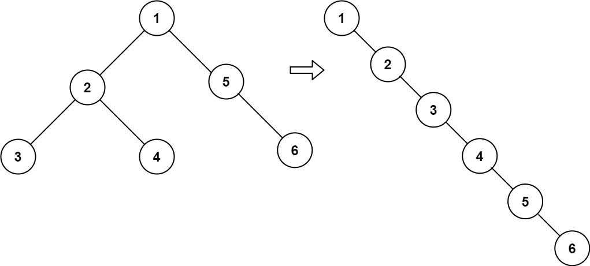

# 114. Flatten Binary Tree to Linked List

Given the `root` of a binary tree, flatten the tree into a "linked list":

- The "linked list" should use the same `TreeNode` class where the `right` child pointer points to the next node in the list and the `left` child pointer is always `null`.
- The "linked list" should be in the same order as a **pre-order traversal** of the binary tree.

**Example 1:**

```
Input: root = [1,2,5,3,4,null,6]
Output: [1,null,2,null,3,null,4,null,5,null,6]
```

**Example 2:**

```
Input: root = []
Output: []
```

**Example 3:**
```
Input: root = [0]
Output: [0]
```

## Approach 1: Recursive (DFS)

### C++ Solution

```cpp
/**
 * Definition for a binary tree node.
 * struct TreeNode {
 *     int val;
 *     TreeNode *left;
 *     TreeNode *right;
 *     TreeNode() : val(0), left(nullptr), right(nullptr) {}
 *     TreeNode(int x) : val(x), left(nullptr), right(nullptr) {}
 *     TreeNode(int x, TreeNode *left, TreeNode *right) : val(x), left(left), right(right) {}
 * };
 */
class Solution {
    TreeNode *tail;
public:
    void flatten(TreeNode* root) {
        if (root == nullptr)
            return;
        // Flatten the left and right subtrees recursively.
        flatten(root->left);
        flatten(root->right);
        TreeNode *leftRoot = root->left;
        TreeNode *rightRoot = root->right;
        root->left = nullptr;
        root->right = leftRoot;
        // Starting from root (since leftRoot might be nullptr), find the tail.
        TreeNode *tail = root;
        while (tail->right)
            tail = tail->right;
        tail->right = right;
    }
};
```

## Approach 2: Morris Traversal