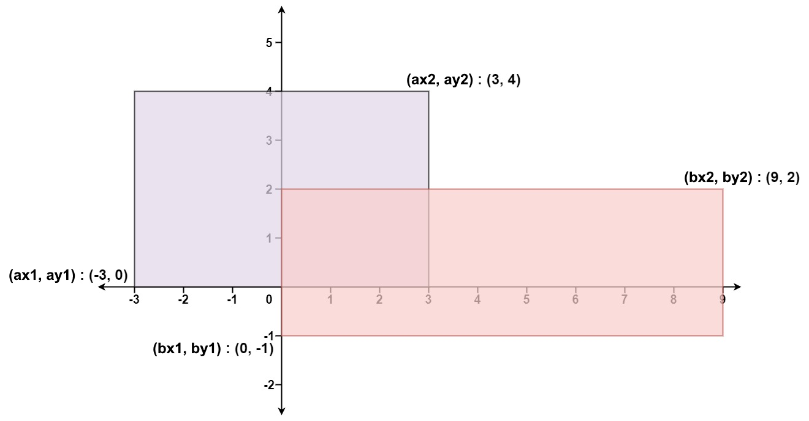

# 223. Reactangle Area

Given the coordinates of two **rectilinear** rectangles in a 2D plane, return _the total area covered by the two rectangles_.

The first rectangle is defined by its **bottom-left** corner `(ax1, ay1)` and its **top-right** corner `(ax2, ay2)`.

The second rectangle is defined by its **bottom-left** corner `(bx1, by1)` and its **top-right** corner `(bx2, by2)`.

**Example 1:**



**Input:** ax1 = -3, ay1 = 0, ax2 = 3, ay2 = 4, bx1 = 0, by1 = -1, bx2 = 9, by2 = 2

**Output:** 45

### C++ Solution

```cpp
class Solution {
public:
    int computeArea(int ax1, int ay1, int ax2, int ay2, int bx1, int by1, int bx2, int by2) {
        int area1 = (ax2 - ax1) * (ay2 - ay1);
        int area2 = (bx2 - bx1) * (by2 - by1);
        int width = max(0, min(ax2, bx2) - max(ax1, bx1));
        int height = max(0, min(ay2, by2) - max(ay1, by1));
        return area1 + area2 - width * height;
    }
};
```
