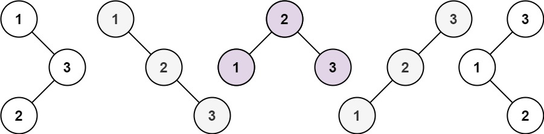

# 22. Generate Parentheses

### Description

Given `n` pairs of parentheses, write a function to generate all combinations of well-formed parentheses.

Example 1:
```
Input: n = 3
Output: ["((()))","(()())","(())()","()(())","()()()"]
```

Example 2:
```
Input: n = 1
Output: ["()"]
```

Constraints:
- `1 <= n <= 8`

### Idea

We keep track of:
- The total number of `(` currently in `s`
- The number of `)` minus the number of of `(` in `s`

Then, if the number of `(` equals the number of `)`, we can only add `(`. And if the number of `(` reaches `n`, we can only add `)`.

### C++ Solution

```cpp
class Solution {
public:
    void buildSolution(vector<string> &ans, string s, int k, int l, int n) {
        if (k == 0 && l == n && s.size() == 2 * n) {
            ans.push_back(s);
        }
        else if (k > n || l > n) {
            return;
        }
        else if (k == 0) {
            buildSolution(ans, s + "(", k + 1, l + 1, n);
        }
        else if (l == n) {
            buildSolution(ans, s + ")", k - 1, l, n);
        }
        else {
            buildSolution(ans, s + "(", k + 1, l + 1, n);
            buildSolution(ans, s + ")", k - 1, l, n);
        }
    }

    vector<string> generateParenthesis(int n) {
        vector<string> ans;
        string s;
        buildSolution(ans, s, 0, 0, n);
        return ans;
    }
};
```

# 44. Wildcard Matching

### Description

Given an input string `s` and a pattern `p`, implement regular expression matching with support for `'?'` and `'*'` where:

- `'?'` Matches any single character.​​​​
- `'*'` Matches sequence of characters (including the empty sequence).

The matching should cover the entire input string (not partial).

Example 1:
```
Input: s = "aa", p = "a"
Output: false
```

Example 2:
```
Input: s = "aa", p = "*"
Output: true
```

Example 3:
```
Input: s = "cb", p = "?a"
Output: false
```

### Idea
- DP with memoization
- `dp[i][j]` means whether the strings `s[0:i+1]` and `p[0:j+1]` can be matched

### C++ Solution

```cpp
class Solution {
public:
    bool memo(vector<vector<int>> &dp, const string &s, const string &p,
              int si, int pi) {
        // Already computed
        if (dp[si][pi] > -1) {
            return dp[si][pi];
        }
        bool ans = 0;
        if (si == 0 && pi > 0) {
            // Can only match when p ends with '*'
            ans = (p[pi - 1] == '*') ? memo(dp, s, p, si, pi - 1) : 0;
        } else if (si > 0 && pi == 0) {
            // No match possible
            ans = 0;
        } else if (s[si - 1] == p[pi - 1] || p[pi - 1] == '?') {
            // Match one character
            ans = memo(dp, s, p, si - 1, pi - 1);
        } else if (p[pi - 1] == '*') {
            // Match zero, one or many characters
            ans = (memo(dp, s, p, si - 1, pi - 1) || memo(dp, s, p, si - 1, pi) ||
                   memo(dp, s, p, si, pi - 1));
        } else {
            ans = 0;
        }
        // Store the answer
        dp[si][pi] = ans;
        return ans;
    }

    bool isMatch(string s, string p) {
        vector<vector<int>> dp(s.size() + 1, vector<int>(p.size() + 1, -1));
        dp[0][0] = 1;
        return memo(dp, s, p, s.size(), p.size());
    }
};
```

# 55. Jump Game

## Description

You are given an integer array `nums`. You are initially positioned at the array's first index, and each element in the array represents your maximum jump length at that position.

Return `true` if you can reach the last index, or `false` otherwise.

## Approach 1 (DP)

### Idea
`dp[i]` means whether we can reach position `i`.

### C++ Solution
```cpp
class Solution {
public:
    bool canJump(vector<int>& nums) {
        vector<bool> dp(nums.size(), false);
        dp[0] = true;
        for (int i = 1; i < nums.size(); ++i) {
            for (int j = i - 1; j >= 0; --j) {
                if (dp[j] && (j + nums[j] >= i)) {
                    dp[i] = true;
                    break;
                }
            }
        }
        return dp[nums.size() - 1];
    }
};
```

### Note

Not efficient

## Approach 2 (Greedy)

### Idea

Start from the last index and keep updating the `goal`. In the end, `goal == 0` indicates that we find a path.


### C++ Solution
```cpp
class Solution {
public:
    bool canJump(vector<int>& nums) {
        int goal = nums.size() - 1;
        for (int i = goal; i >= 0; --i) {
            if (i + nums[i] >= goal) {
                goal = i;
            }
        }
        return goal == 0;
    }
};
```

## Approach 3 (Greedy)

### Idea
[Link to the original solution on LeetCode](https://leetcode.com/problems/jump-game/solutions/4534808/super-simple-intuitive-8-line-python-solution-beats-99-92-of-users/). Imagine that we are driving a car that has some amount of gas. We co


### C++ Solution
```cpp
class Solution {
public:
    bool canJump(vector<int>& nums) {
        int n = nums.size();
        int gas = 0;
        for (int i = 0; i < n; ++i) {
            if (gas < 0) {
                return false;
            }
            gas = max(gas, nums[i]);
            gas--;
        }
        return true;
    }
};
```

# 72. Edit Distance

### Description
Given two strings `word1` and `word2`, return the minimum number of operations required to convert `word1` to `word2`.

You have the following three operations permitted on a word:

- Insert a character
- Delete a character
- Replace a character

### C++ Solution

```cpp
class Solution {
public:
    int minDistance(string s, string t) {
        int m = s.size();
        int n = t.size();
        vector<vector<int>> dp(m + 1, vector<int>(n + 1, 0));
        for (int i = 0; i <= m; ++i) {
            dp[i][0] = i;
        }
        for (int i = 0; i <= n; ++i) {
            dp[0][i] = i;
        }
        for (int i = 1; i <= m; ++i) {
            for (int j = 1; j <= n; ++j) {
                if (s[i - 1] == t[j - 1]) {
                    dp[i][j] = dp[i - 1][j - 1];
                } else {
                    int thisMin = INT_MAX;
                    thisMin = min(thisMin, dp[i - 1][j - 1]);
                    thisMin = min(thisMin, dp[i - 1][j]);
                    thisMin = min(thisMin, dp[i][j - 1]);
                    dp[i][j] = thisMin + 1;
                }
            }
        }
        return dp[m][n];
    }
};
```

# 95. Unique Binary Search Trees II

### Description
Given an integer `n`, return all the structurally unique BST's (binary search trees), which has exactly `n` nodes of unique values from `1` to `n`. Return the answer in any order.

Example 1:


### C++ Solution

# 96. Unique Binary Search Trees

### Description
Given an integer `n`, return the number of structurally unique BST's (binary search trees) which has exactly `n` nodes of unique values from `1` to `n`.


Example 1:


### C++ Solution

```cpp
class Solution {
public:
    int numTrees(int n) {
        vector<int> dp(n + 1, 0);
        dp[0] = 1;
        dp[1] = 1;
        for (int i = 2; i <= n; ++i) {
            for (int j = 1; j <= i; ++j) {
                dp[i] += dp[j - 1] * dp[i - j];
            }
        }
        return dp[n];
    }
};
```

### Additional Notes
https://en.wikipedia.org/wiki/Catalan_number

# 110. Regular Expression Matching

### Description

Given an input string `s` and a pattern `p`, implement regular expression matching with support for `'.'` and `'*'` where:

- `'.'` Matches any single character.​​​​
- `'*'` Matches zero or more of the preceding element.

The matching should cover the entire input string (not partial).

Example 1:
```
Input: s = "aa", p = "a"
Output: false
```

Example 2:
```
Input: s = "aa", p = "a*"
Output: true
```

Example 3:
```
Input: s = "ab", p = ".*"
Output: true
```

### Idea
- DP with memoization
- `dp[i][j]` means whether the strings `s[0:i+1]` and `p[0:j+1]` can be matched

### C++ Solution

```cpp
class Solution {
public:
    bool memo(vector<vector<int>> &dp, const string &s, const string &p,
              int si, int pi) {
        // Already computed
        if (dp[si][pi] > -1) {
            return dp[si][pi];
        }
        bool ans = 0;
        if (si == 0 && pi > 0) {
            // s is empty string but p is not => can only match '*'
            ans = (p[pi - 1] == '*') ? memo(dp, s, p, si, pi - 2) : 0;
        } else if (si > 0 && pi == 0) {
            // p is empty string but s is not => no match possible
            ans = 0;
        } else if (s[si - 1] == p[pi - 1] || p[pi - 1] == '.') {
            // Match a single character => go back by one
            ans = memo(dp, s, p, si - 1, pi - 1);
        } else if (p[pi - 1] == '*') {
            char prev = p[pi - 2];
            if (prev == '.' || s[si - 1] == prev) {
                // Match a single character in s, continue matching with p,
                // or match zero characters
                ans = (memo(dp, s, p, si - 1, pi - 2) || memo(dp, s, p, si - 1, pi) ||
                       memo(dp, s, p, si, pi - 2));
            } else {
                // Match zero characters in p => go back by two
                ans = memo(dp, s, p, si, pi - 2);
            }
        } else {
            // All other cases without a match
            ans = 0;
        }
        // Store the computed result
        dp[si][pi] = ans;
        return ans;
    }

    bool isMatch(string s, string p) {
        // Remember the + 1 here.
        vector<vector<int>> dp(s.size() + 1, vector<int>(p.size() + 1, -1));
        dp[0][0] = 1;
        return memo(dp, s, p, s.size(), p.size());
    }
};
```

# 122. Best Time to Buy and Sell Stock II

### Description

You are given an integer array `prices` where `prices[i]` is the price of a given stock on the `i`th day.

On each day, you may decide to buy and/or sell the stock. You can only hold **at most one** share of the stock at any time. However, you can buy it then immediately sell it on the **same day**.

Find and return the **maximum** profit you can achieve.

### Idea

We keep track of:
- `dp0`: the maximum profit for **not holding** a share on the previous day.
- `dp1`: the maximum profit for **holding** a share on the previous day.

### C++ Solution

```cpp
class Solution {
public:
    int maxProfit(vector<int>& prices) {
        int dp0 = 0;             // not holding
        int dp1 = -prices[0];    // holding
        for (int i = 1; i < prices.size(); ++i)
        {
            dp0 = max(dp0, dp1 + prices[i]);
            dp1 = max(dp1, dp0 - prices[i]);
        }
        return dp0;
    }
};
```

# 309. Best Time to Buy and Sell Stock with Cooldown

### Description

You are given an array `prices` where `prices[i]` is the price of a given stock on the ith day.

Find the maximum profit you can achieve. You may complete as many transactions as you like (i.e., buy one and sell one share of the stock multiple times) with the following restrictions:

After you sell your stock, you cannot buy stock on the next day (i.e., cooldown one day).

**Note**: You may not engage in multiple transactions simultaneously (i.e., you must sell the stock before you buy again).

### Idea

We keep track of:
- `dp0`, where `dp0[i]` is the maximum profit for **not holding** a share on the `i`th day.
- `dp1`, where `dp1[i]` is the maximum profit for **holding** a share on the `i`th day.

### C++ Solution

```cpp
class Solution {
public:
    int maxProfit(vector<int>& prices) {
        int n = prices.size();
        if (n == 1) {
            return 0;
        }
        vector<int> dp0(n, 0);        // not holding
        vector<int> dp1(n, 0);        // holding
        dp1[0] = -prices[0];
        dp1[1] = max(-prices[0], -prices[1]);
        dp0[1] = max(prices[1] - prices[0], 0);
        for (int i = 2; i < n; ++i) {
            dp0[i] = max(dp1[i - 1] + prices[i], dp0[i - 1]);
            dp1[i] = max(dp0[i - 2] - prices[i], dp1[i - 1]);
        }
        return dp0[n - 1];
    }
};
```
